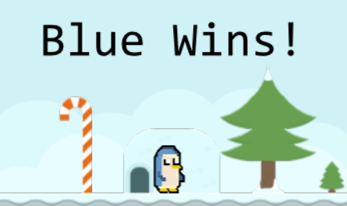
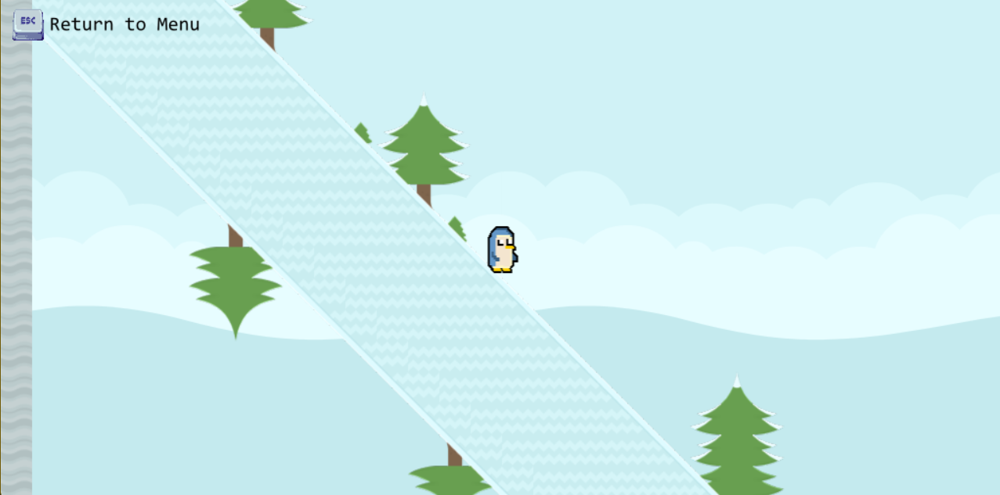
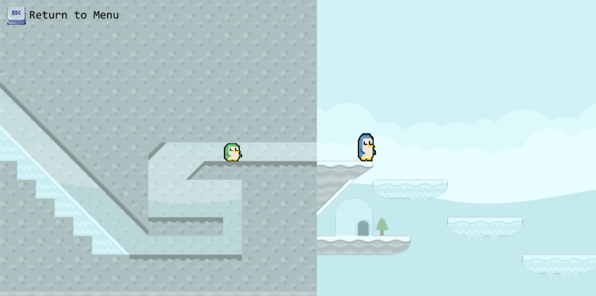

# Penguin Racing

A silly, short 2D platformer made to experiment with [LÖVE (Love2D)](https://love2d.org/).

## 📜 Description

Penguin Racing is very casual game designed for couch co-op but playable alone platformer with basic levels and physics to have a good time. 
This was made primarily with Assets from Kenney (and other open source art from itch.io) to learn LOVE and experiment for fun.

## 🚀 Features

- Two-player support (WASD & Arrow Keys)
- Randomized level design

## 🛠 Installation
### Running the Game without LOVE2D
Under Release run the PenguinRacing.bat file or manually run the .exe located in PenguinRacingExe

### Running the Game with LOVE2D
If you have LOVE2D simple run the PenguinRacing.love file in Releases and you're in it 

